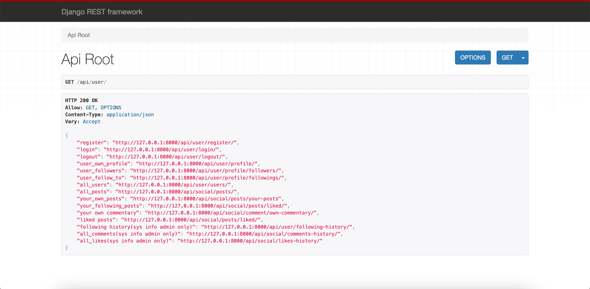
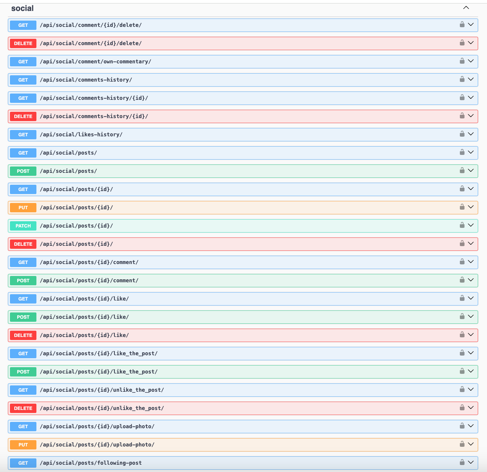
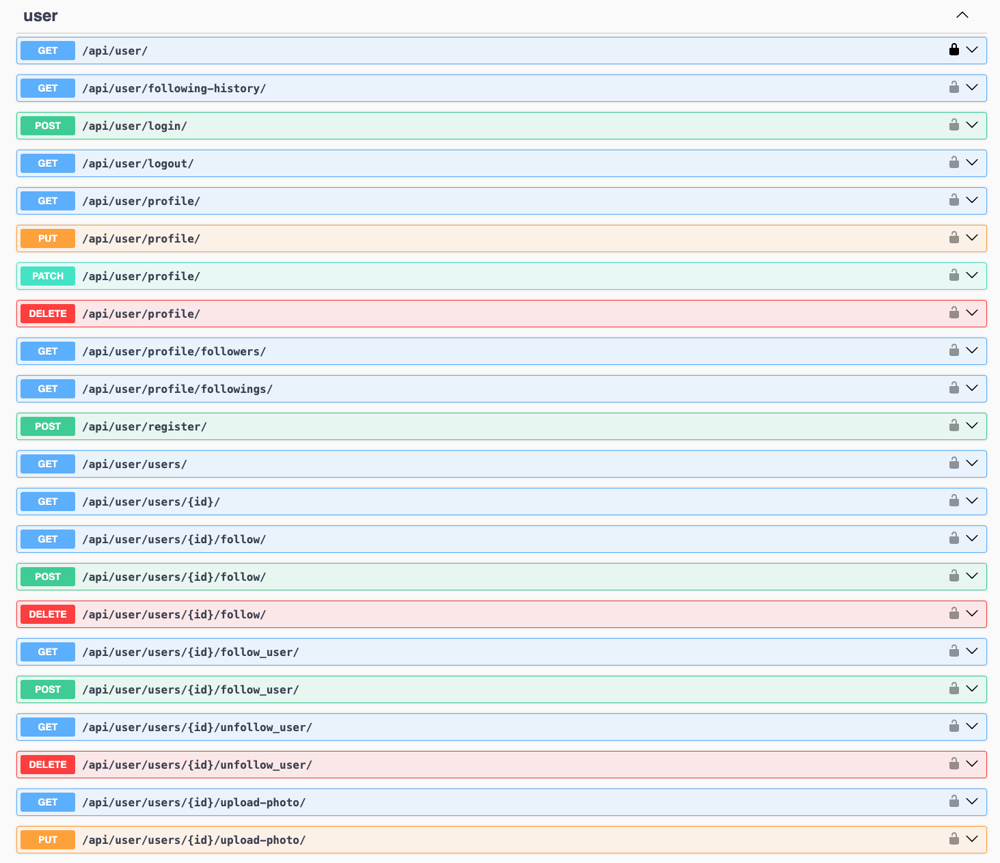

# Social media API
API for social media service written on DRF

### Installing using GitHub
Python3 must be already installed. Install PostgresSQL and create db.


```shell
git clone https://github.com/asdadaversa/social-media-api.git
cd social-media-api
python3 -m venv venv
venv\Scripts\activate (on Windows)
source venv/bin/activate (on macOS)
pip install -r requirements.txt
```

### Environment Variables Setup
1. Create a `.env` file in the root directory of your project.
2. Set up it as in '.env.sample'
```
SECRET_KEY=SECRET_KEY
POSTGRES_HOST=POSTGRES_HOST
POSTGRES_DB=POSTGRES_DB
POSTGRES_USER=POSTGRES_USER
POSTGRES_PASSWORD=POSTGRES_PASSWORD
DB_PORT=DB_PORT
```

### Next run migrations and run server

```bash
$ python manage.py makemigrations
$ python manage.py migrate
$ python manage.py runserver

```


## Use the following command to load prepared data from fixture:

`python manage.py loaddata db_data.json`

- After loading data from fixture you can use following superuser (or create another one by yourself):
  - email: `admin@pes.com`
  - Password: `Qwerty.1`


## Run with docker
Docker should be installed
```
set up your .env for docker, for e.g.
POSTGRES_HOST=db
POSTGRES_DB=app
POSTGRES_USER=postgres
POSTGRES_PASSWORD=secretpassword

next run:
- docker-compose build
- docker-compose up

Use the following command to load prepared data from fixture for docker:
docker-compose run app sh -c "python manage.py loaddata db_data.json"

```


## Getting access:
  - Create user - /api/user/register
  - Get access token - /api/user/login

You can load ModHeader extension for your browser and add request header token. Example:
  - key: Authorization
  - value:Token 3a3c968a04367b9f4e853fd2dfb27ee1e1266ea6

## Features
- Token authenticated
- Admin panel /admin/
- Documentation is located at /api/doc/swagger/
- Create user and profiles, edit and delete your own  profile
- Search users by name, age, city, country
- Creating posts with adding images, and hashtags, editing your own posts
- search posts by title, content, hashtags
- Create commentary and delete your own comments
- Ability follow and unfollow user
- Page with followers and following
- Page with your own post and post your following
- Like and unlike post
- Page with posts that you liked
- Lists of commentary, likes, following history (only for admin)


## Browsable api root
> To access browsable api root, use http://127.0.0.1:8000/api/user/

## API Endpoints
<details>
  <summary>User Profile</summary>

- **Create User**: `POST /api/user/register/`
- **Login**: `POST /api/user/login/`
- **Logout**: `POST /api/user/logout/`
- **Retrieve User Profile**: `GET /api/user/profile/`
- **List User followers**: `GET /api/user/profile/followers/`
- **List User followings**: `GET /api/user/profile/followings/`

</details>

<details>
  <summary>Users</summary>

- **List Users**: `GET /api/user/users/`
- **Retrieve User**: `GET /api/user/users/{user_id}/`
- **Follow Users**: `POST /api/user/users/{user_id}/follow/`
- **Unfollow Users**: `DELETE /api/user/users/{user_id}/follow/`
- **Follow Users**: `POST /api/user/users/{user_id}/follow_user/`
- **Unfollow Users**: `DELETE /api/user/users/{user_id}/unfollow_user/`
- **Upload Photo**: `POST /api/user/users/1/upload-photo/`
</details>


<details>
  <summary>Posts</summary>

- **List Posts**: `GET /api/social/posts/`
- **Create Post**: `POST /api/social/posts/`
- **Retrieve Post**: `GET /api/social/posts/{post_id}/`
- **Update Post**: `PUT /api/social/posts/{post_id}/`
- **Post Like Post**: `POST /api/social/posts/{post_id}/like/` 
- **Delete Like Post**: `DELETE /api/social/posts/{post_id}/like/`
- **Like Post**: `POST /api/social/posts/{post_id}/like_the_post/`
- **Delete Like**: `DELETE /api/social/posts/{post_id}/unlike_the_post/`
- **Post Upload image**: `POST /api/social/posts/{post_id}/upload-photo/`
</details>


<details>
  <summary>Personal posts</summary>

- **List Your Own Posts**: `GET /api/social/posts/your-posts`
- **Post You liked**: `GET /api/social/posts/liked/`
- **Post Your Followings**: `GET /api/social/posts/following-post/`
</details>

<details>
  <summary>Commentary</summary>

- **List Your Own Commentary**: `GET /api/social/comment/own-commentary/`
- **Post Comment**: `POST /api/social/posts/{post_id}/comment/`
- **Delete Comment**: `DELETE /api/social/comment/{commentary_id}/delete/`
</details>

<details>
  <summary>Admin only, system features</summary>

- **List Following history**: `GET /api/user/following-history/`
- **List Comment history**: `GET /api/social/comments-history/`
- **Retrieve Comment**: `GET /api/social/comments-history/{commentary_id}/`
- **Delete Comment**: `DELETE /api/social/comments-history/{commentary_id}/`
- **List Like history**: `GET /api/social/likes-history/`

</details>

## Documentation
- The API is documented using the OpenAPI standard.
- Access the API documentation by running the server and navigating to http://127.0.0.1:8000/api/doc/swagger/ or http://127.0.0.1:8000/api/doc/redoc/.


## Contributing
Feel free to contribute to these enhancements, and let's make our Social Media Service API even better!


# Endpoints 




